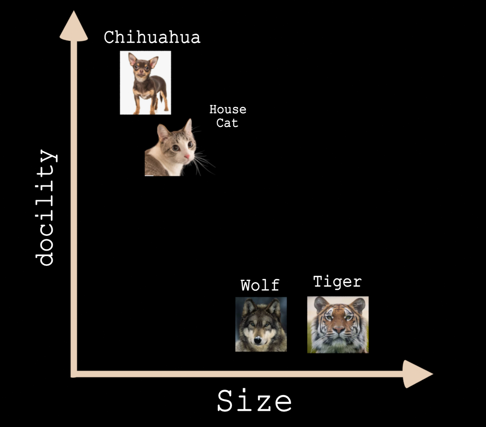
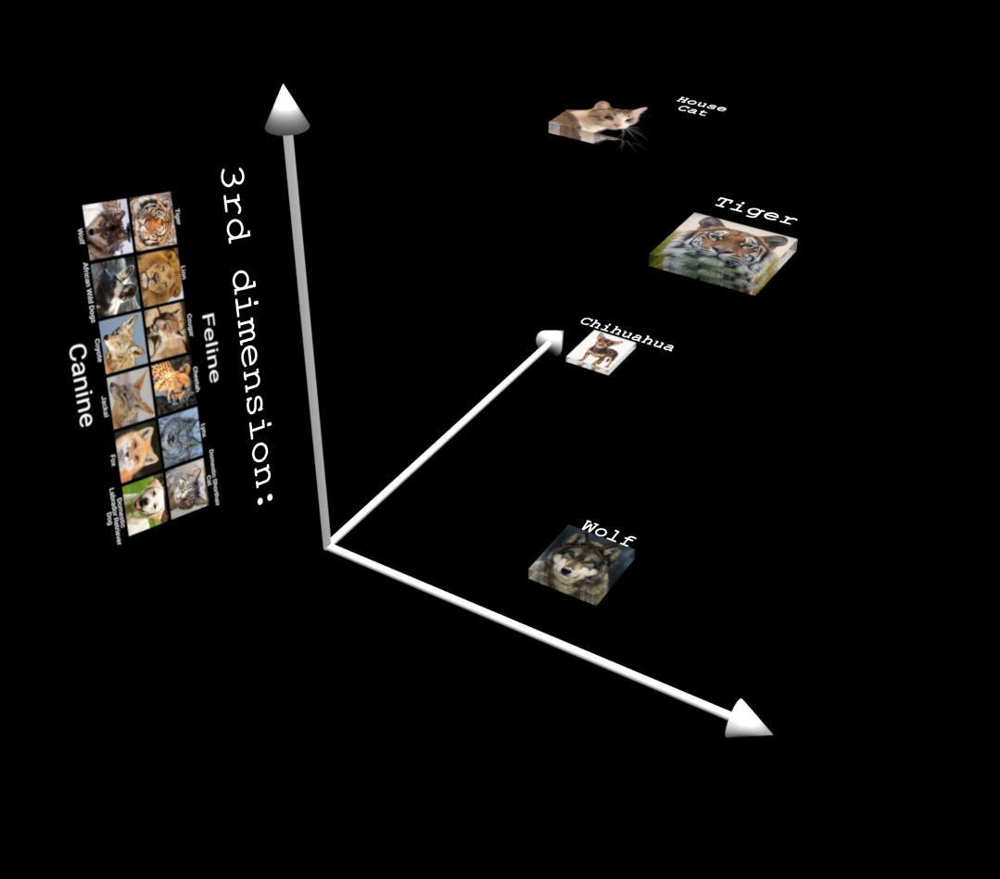
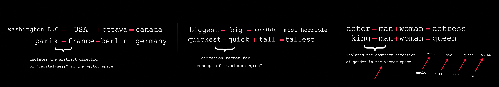
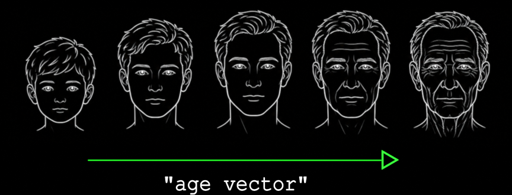
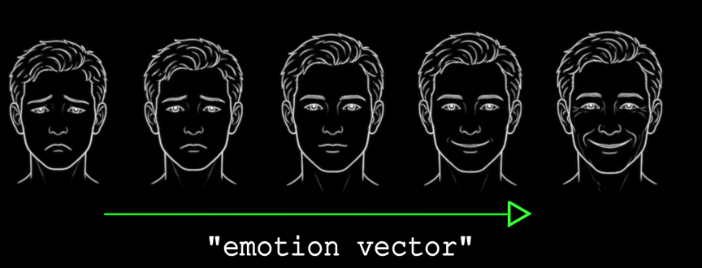
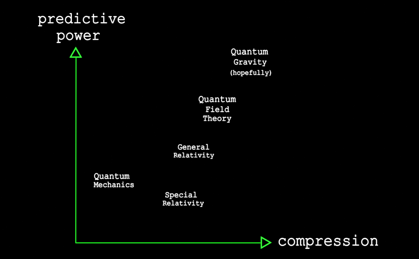

# Level 0

## concepts as vectors(semantic spaces)

In this part we illustrate how Artificial-Neural-Networks(ANNs) encode their understanding of different concepts & relationships.

lets start w/ a simple example:

```python

house_cat = [0.2, 0.9]  # Small, highly domesticated
tiger     = [0.8, 0.1]  # Medium-large, highly wild
wolf      = [0.6, 0.15] # Medium, wild
chihuahua = [0.1, 0.95] # Very small, highly domesticated

```

in a more visual form:




**The main idea is this:**\
We can describe concepts(tigers, cat &...) which may contain many features and traits as a vector, a point in a multi-dimensional space. how far along each dimension the point is(tiger=0.8 along the size dim, cat only 0.2) will indicate the intensity of that trait. 


adding more dimensions to our space, allows us to describe concepts in terms of more features, enabling more accurate representation & understanding.

```python
house_cat = [0.2, 0.9, 1.0]  # Small, highly domesticated, Feline
tiger     = [0.5, 0.1, 1.0]  # Medium-large, highly wild, Feline
wolf      = [0.4, 0.15, 0.0] # Medium, wild, canine 
chihuahua = [0.1, 0.95, 0.0] # Very small, highly domesticated, canine 


```




in addition to organizing concepts, vectors can also transform one concept to the other:




and simply moving along one dimension of the ANN's representation space, can correspond to its output image becoming older or younger
\
(just imagine if we train an ANN on all biological data & we discover this "youth vector!"), 


happier or sadder...


\
the main point of training neural networks is the formation & emergence of this vector space which represents concepts & relationships in the real world as vectors, once we have the right representations, all the downstream tasks become possible, from simple classification, generation, to discovery(extrapolating along vector!)




these vector spaces allow for "true understanding" across many fields & relationships, discovering connections & making inventions that empower humanity to build better machines, cure cancer & more...

\
cool analogy:\
playing 20-questions is like doing binary search(yes/no answers) over the space of concepts!

\
now lets build the computational machinery enabling these vector spaces:

## the linear layer & batched IO (XW=Y)

we will start w/ the simplest primitive in modern AI systems, the linear layer

## gradient descent via back-propagation
## normalization & optimizers
