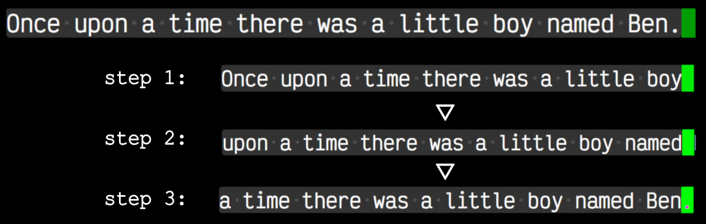

Text Dataset:

I've chosen the "Tiny Stories" for our model training dataset, it's a bunch of small & simple kids stories.

you don't have to download the 5GB dataset from Hugging Face, I've done it and extracted the first 10Mib of it as our training dataset and the next 1Mb as our test dataset. 

lets take a look:

a bunch of simple stories,

these are what's called "special tokens", this dataset was made by another LLM chatbot & these tokens are used to tell the LLM were a document ends & a new one begins, & the LLM uses these tokens to say it has finished generating the answer to a prompt.

our training goal:
* given a sequence as input, output that sequence shifted one token to the right

---

Image Dataset:

The work-horse of ML, the good-old reliable MNIST dataset.
28*28 grey-scale images of hand-written digits.

here is our training objective:

given a canvas of 28*(2*28) we train our model to complete the image based upon these rules:

* if only the top layer of pixels are white     -> right digit =  (left digit + 1) mod 10
* if the top & bottom layer of pixels are white -> right digit =  (left digit + 2) mod 10

we generate a dataset each sample being a canvas containing a pair of digits.

then corrupt the canvas by picking a few spots as seed positions and setting their surrounding pixels to random values, the trained model must be able to output the clean canvas.

another task is to randomize one side of the canvas & let the model output the complete canvas.

---

Tokenization:

Vectors are the universal language, in Tokenization we map sub-words, image/audio chunks into vectors, so our model can process our world. 

The trade-offs:

why not map an entire sentence/image into just one token? 
why not map a  single letter/pixel   into just one token? 

It is a balancing act between average length and content capacity: 

If the chunk of text or image is too big(too many letter or pixels) the embed_dim sized vector cannot represent its content well enough, so the model cannot learn the hidden relationships of the data...

If the chunk is too small(a single letter or pixel) then tokenizing an image or sentence results in a large number of tokens, and this lengthy token sequence is very expensive for our transformer to process, because it needs to let each token communicate w/ every other token in the same sequence(cost: O(n^2))...

---

Tokenizing Text:

Now let's write the code to tokenize text:

Ideally we want the most commonly occurring letter groups to be packaged-up into one token, that way the average length of any sequence in our dataset will be shorter:

for example:
hello, he, hell, hesitate, -> 'he'

Now let's write an algorithm that:

1. counts the frequencies of all adjacent pairs of symbols
2. merges the most frequently co-occurring pairs 

the repeat this process until we hit the limit of our vocabulary size.

vocabulary size is the number of unique symbols our model can emit, a larger number makes the model more expressive(entropy rate = log 1/vocab) but also more expensive(the output liner layer is 'embed_dim' by 'vocab_size')

---

Tokenizing Images: