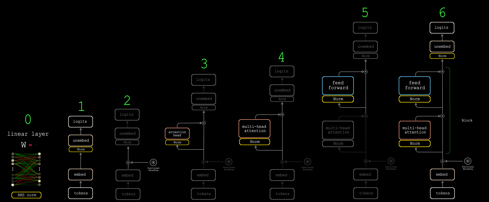

# Why Care about AI ?

This course will give you a deep understanding of neural networks, more specifically, the Transformer architecture, arguably the closest humanity has come to a “**Scalable Universal Learning Algorithm**.”

Concepts underlying modern AI are extremely general-purpose. 
To judge them solely by their current applications (in LLMs) is like judging the uses of electricity based on 19th century appliances, it's missing the larger point: 
these are pattern learning & discovery machines. the foundations for enabling us to build Dyson Swarms, unify Quantum Field Theory & General Relativity, solve aging & exceed our biological limits in perception & thought(20W meat machines), build interstellar economies & talk to intelligent alien civilizations... 

AI may get over-hyped in the short-term, but it is extremely under-hyped in the long-term, the products & businesses may come & go, but the computational & mathematical ideas of creating intelligence are as close to eternal as us mere mortals can reach.

Contrary to popular belief, these neural-nets are not "un-interpretable black boxes", they are **grown** "computational organisms", they go through a developmental process much like biological embryos, the representations & circuitry they develop rivals works of art such as Mona-Lisa, Sistine Chapel & may others, in this course we develop the "mind's eye" capable of appreciating & **building** these beauties.

# why this course ?

- Rather than presenting the Transformer as one complex architecture, we will construct it incrementally

- A from-scratch PyTorch implementation(using einops so every tensor shape & operation is explicitly clarified), visualizing the model's "tensor anatomy" & "computational physiology"

- The course is designed to be as "stand alone" as possible, a new pedagogical method used is "Q4AI" which are prompts for the student to give their favorite AI chatbot, covering any possible ambiguities or missing pre-requisite.

- There will be small web-apps you can download & run locally letting you experiment w/ the abstract math concepts to make them more intuitive & concrete(like softmax, cross-entropy &...)

- hardware integrated approach, knowing how the hardware(GPUs, TPUs, accelerators) executes the software is crucial for scaling up, where will the performance bottlenecks & how to solve them

- how to scale your large-scale training & inference, to many devices & datacenters efficiently

- citations to relevant papers, blogs & videos for deeper dives 

hardware requirements:\
minimal, use free [Google Colab](https://colab.research.google.com) if you don't have access to GPU w/ at least 2GB VRAM.

---

video version of this blog series:

---

# [Level 0](blogs/level-0.md)
    concepts as vectors(semantic spaces)\
    the linear layer & batched IO (XW=Y)\
    gradient descent via back-propagation\
    normalization & optimizers

# [Level 1](blogs/level-1.md)
    x\
    cross-entropy loss
    z\

# [Level 2](blogs/level-2.md)
    positional encodings,for text & images, why & how
    residual connections
    z\

# [Level 3](blogs/level-3.md)
    x\
    y\
    z\
    
# [Level 4](blogs/level-4.md)
    x\
    y\
    z\
# [Level 5](blogs/level-5.md)
    x\
    y\
    z\

